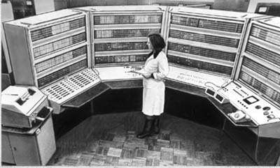

Этот сайт представляет собой архив материалов о советской ЭВМ БЭСМ-6,
а также других машинах этого семейства: М20, СВС-Б, Эльбрус-1КБ и
МКБ-8601 (микро-БЭСМ).

Предполагаются следующие разделы:

 * [Wiki](wiki) &mdash; статьи и описания, пополняемые участниками сообщества
 * [Документация](doc) &mdash; отсканированные документы в форматах PDF и DJVU
 * [Исходники](sources) &mdash; сохранившиеся и восстановленные исходные тексты программного обеспечения
 * [Файлы](download) &mdash; бинарные файлы и архивы для скачивания
 * [Картинки](pictures) &mdash; исторические фотографии и графические материалы
 * [Новости](blog) &mdash; сообщения, добавляемые участниками сообщества на периодической основе

---

# Новости бэсмостроения


  [{{ post.title | escape }} &mdash; {{ post.date | date: "%b %-d, %Y" }}]({{ post.url }})

