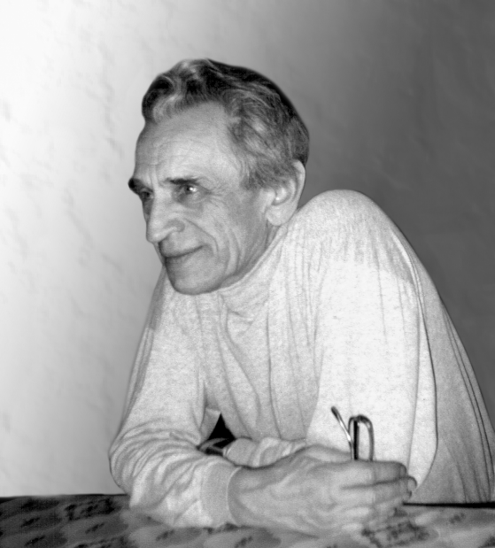

# К восьмидесятилетию Виталия Александровича Ростовцева

23 мая 2012 года исполняется 80 лет Виталию Александровичу
Ростовцеву, известному специалисту в области системного
программирования и компьютерной алгебры.

В.А. Ростовцев родился 23 мая 1932 г. в Туле. В послевоенные
годы учился в техникуме, работал на заводе, служил в армии.

В 1958 г., после демобилизации, он пришел в КБ Лавочкина, где
занимался задачами баллистики. Затем, в одной из московских
организаций оборонного характера, участвовал в создании
транслятора с Фортрана для ЭВМ “Весна”. Дипломная работа,
защищенная им в это время на заочном отделении
физико-математического факультета Мордовского государственного
университета, также была посвящена вопросам трансляции языков
программирования.

Интерес к проблемам трансляции привел Виталия Александровича в
знаменитый семинар М.Р. Шуры-Буры “Автоматизация
программирования” в МГУ. В 1967 г. на одном из его заседаний
выступил Н.Н. Говорун, заместитель директора Лаборатории
вычислительной техники и автоматизации Объединенного института
ядерных исследований (ОИЯИ) в Дубне. Он рассказал, что
собранной им группой сотрудников решается задача создания
математического обеспечения для БЭСМ-6 (операционной системы,
транслятора с Фортрана и т.д.). Виталий Александрович побывал в
ОИЯИ и встретился с Н.Н. Говоруном, который вскоре пригласил
его влиться в группу разработчиков. Виталий Александрович стал
сотрудником ОИЯИ и жителем Дубны.

Работы по созданию транслятора с языка Фортран-Дубна и ОС
“Дубна” для БЭСМ-6 были своевременно и успешно выполнены. А
Виталий Александрович еще долгие годы плодотворно работал
вместе с Н.Н. Говоруном – c 1967 г. до 1976 г. он возглавлял
группу межмашинного взаимодействия, принимал участие в создании
и сопровождении математического обеспечения для базовых ЭВМ и
измерительно-вычислительного комплекса ОИЯИ. В этот период
Виталий Александрович участвовал в решении и прикладных задач,
например, в исследовании структуры молекулы пепсина (в рамках
сотрудничества с Институтом молекулярной биологии АН СССР).

Виталий Александрович не замыкался только на этой работе,
активно интересуясь и знакомясь с литературой по самым разным
аспектам программирования. В библиотеке ОИЯИ в трудах одной из
физических конференций он нашел статью А. Херна о программе
символьных вычислений Редьюс, способной, в частности, символьно
выполнять трудоемкие операции алгебры γ-матриц Дирака, что
позволяло эффективно проводить расчеты по диаграммам Фейнмана,
зачастую исключительно громоздкие. Виталий Александрович
рассказал коллегам об этой заманчивой для физиков возможности и
многих увлек этими идеями. Впоследствии, когда к Н.Н. Говоруну
обратился с близкой задачей Я.А. Смородинский, Виталию
Александровичу было предложено вплотную заняться этой
проблематикой. Так началась научная деятельность Виталия
Александровича в области компьютерной алгебры.

В середине 70-х, во время визита А. Херна в ОИЯИ, Виталий
Александрович получил вместе с консультациями по Редьюсу также
и некоторый программный код. Но надо было заставить работать
R-Лисп (язык, на котором написана система) на машине CDC-6200,
к тому времени установленной в ОИЯИ: программы, полученные
Виталием Александровичем, были написаны на нестандартном и
недоступном у нас в стране автокоде. Потребовалось скрупулезное
изучение огромнейшего листинга, исследование связей всех
блоков, переписывание многих фрагментов программы и т.д.
Виталий Александрович довел эту огромную работу до конца.

В результате титанических усилий Виталия Александровича
сотрудники ОИЯИ получили мощную универсальную систему.
Компьютерная алгебра стала рабочим инструментом математиков и
физиков, и Виталий Александрович – один из тех, кто внес
наибольший вклад в освоение и развитие этой научной дисциплины
в ОИЯИ. Это несомненно, повлияло на интерес в нашей стране к
компьютерной алгебре многих и многих исследователей.

Сегодня Виталий Александрович принадлежит к числу самых
авторитетных и опытных специалистов в области компьютерной
алгебры. В сотрудничестве с физиками и математиками им
выполнены работы по аналитическим расчетам в теории
гравитационных полей и по расчету асимптотик эффективных
потенциалов в квантово-механической задаче трех тел;
опубликованы алгоритмы и программы по применению компьютерной
алгебры при приведении к нормальной форме полиномиальных
гамильтонианов и для решения квантово-механических задач на
собственные значения и задач рассеяния – в журнале
“Программирование”, в трудах серии конференций Computer Algebra
in Scientific Computing и в библиотеке программ журнала
“Computer Physics Communications”; а также выполнен цикл работ
по применению компьютерной алгебры при расчетах, связанных с
эксклюзивными процессами в квантовой хромодинамике. Всего
Виталием Александровичем опубликовано более 80 статей в
отечественных и зарубежных научных журналах. В 1986 г. в
составе коллектива авторов был удостоен первой премии ОИЯИ.

Виталий Александрович – постоянный участник Всероссийских и
международных конференций – и как член оргкомитетов, и как
автор докладов. Он также активно участвует в организационной и
научной работе ежегодных совместных заседаний (по существу –
двухдневных конференций) семинаров по компьютерной алгебре МГУ
и ОИЯИ.

Вокруг Виталия Александровича всегда много молодёжи, он щедро
делится с ней своим опытом, с истинным энтузиазмом занимается
преподаванием – сначала в Дубненском филиале МИРЭА, а затем, c
1994 г., – в университете “Дубна”.

В настоящее время Виталий Александрович продолжает активно
заниматься любимым делом; он сотрудничает с физиками, планирует
новые лекционные курсы. Хочется от души поздравить его с
юбилеем, пожелать ему крепкого здоровья, неиссякающей энергии и
успешной реализации всего задуманного.

Редколлегия журнала “Программирование”. Участники семинара
“Компьютерная алгебра” факультета вычислительной математики и
кибернетики МГУ им. М.В. Ломоносова.

[(c) 2012 "Программирование", №3, с. 77–78](http://compalg.jinr.ru/CAGroup/Rostovtsev/Rostovtsev80.pdf)
