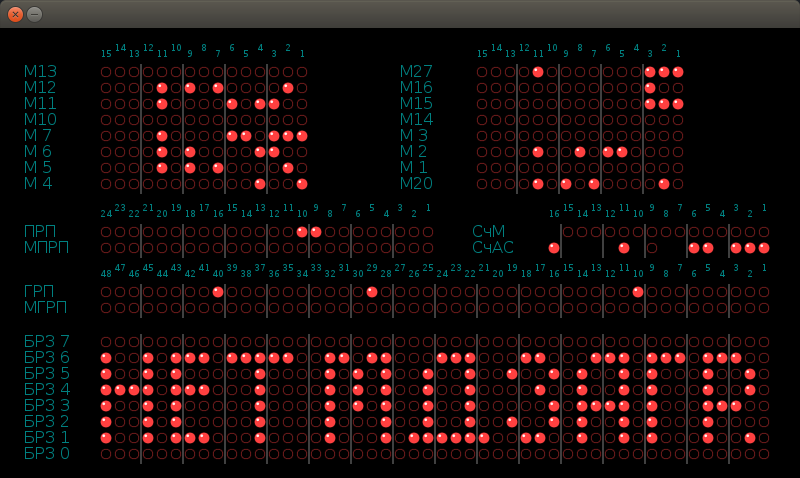
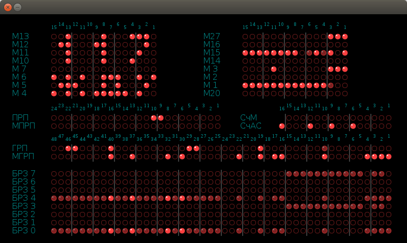

# Сборка и запуск эмулятора БЭСМ-6

На момент написания этой страницы актуальным эмулятором ЭВМ БЭСМ-6 является крупный проект SIMH - The Computer History Simulation Project [официальный сайт](http://simh.trailing-edge.com) с включенным туда оригинальным кодом за авторством Сергея Вакуленко и Леонида Брухиса.

Проект эмулятора на github [https://github.com/simh/simh](https://github.com/simh/simh)

## Инструкции по сборке из исходных текстов
Ниже даны инструкции по сборке эмулятора в системе Ubuntu Linux 16.04 LTS и совместимых

### Установка сборочных зависимостей
```
sudo apt install git libsdl-dev libsdl-ttf2.0-dev
```
Также необходимо убедиться, что в системе установлен хотя бы один из шрифтов:

* DejaVuSans.ttf
* LucidaSansRegular.ttf
* FreeSans.ttf
* AppleGothic.ttf
* tahoma.ttf

### Получить исходные тексты эмулятора
```
git clone https://github.com/simh/simh.git
```

### Собрать цель besm6
```
cd simh
make besm6
```

### Запуск эмулятора
Конфигурация подключенных к БЭСМ-6 устройств, образов дисков и т.д., задается в ini файлах.

В качестве примера используем конфигурацию для запуска ОС Диспак - dispak.ini, который поставляется в комплекте с исходными текстами:

```
cd BESM6
../BIN/besm6 dispak.ini
```

Далее, в текстовой консоли получим отладочный вывод:

    БРЗ [7] = '                                                '
    БРЗ [6] = '*  * *** *****  ** **   ***   **   *** *** ***  '
    БРЗ [5] = '*  * *     *    * * *  *  *  *  * *  * *   *  * '
    БРЗ [4] = '**** ***   *    * * *  *  *    *  *  * *   *  * '
    БРЗ [3] = '*  * *     *    * * *  *  *     * **** *   ***  '
    БРЗ [2] = '*  * *     *    *   *  *  *  *  * *  * *   *    '
    БРЗ [1] = '*  * ***   *    *   * ******  **  *  * *   *  * '
    БРЗ [0] = '                                                '

    Останов, "СчАС": 02067 (стоп, -> пб 2040)

Это означает, что эмуляция работает и начальный загрузчик не смог найти диск ОС ДИСПАК.

Если теперь включить отображение фронтальной панели командой эмулятора     **`set panel`** то получим красивую картинку:



Здесь неонки буферных регситров записи сообщают нам о причине останова.

### Скачивание образов дисков ОС ДИСПАК
В архиве документации БЭСМ-6 на github [образы дисков и лент](https://github.com/besm6/besm6-archive/tree/master/disks) необходимо скачать следующие файлы (по dispak.ini):
```
sbor2053.bin
krab2063.bin
sbor2048.bin
svs2048.bin
alt2048.bin
```

### Постоянное отображение фронт-панели
Для этого необходимо добавить в первых строках **dispak.ini**:
**`set panel`**

### Запуск ОС ДИСПАК
Из рабочего каталога `simh/BESM6` выполнить команду:
```
../BIN/besm6 dispak.ini
```



Приятного использования БЭСМ-6 !!!
