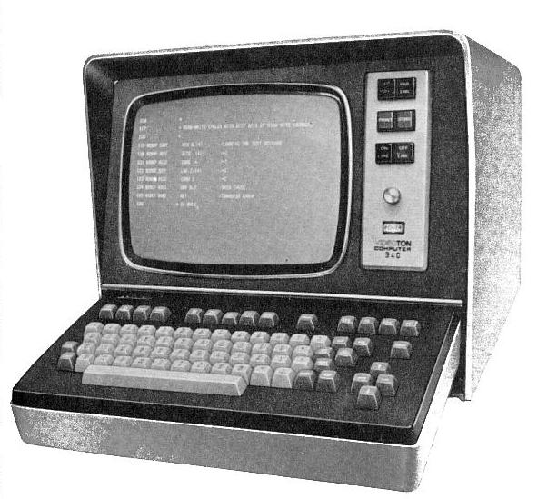
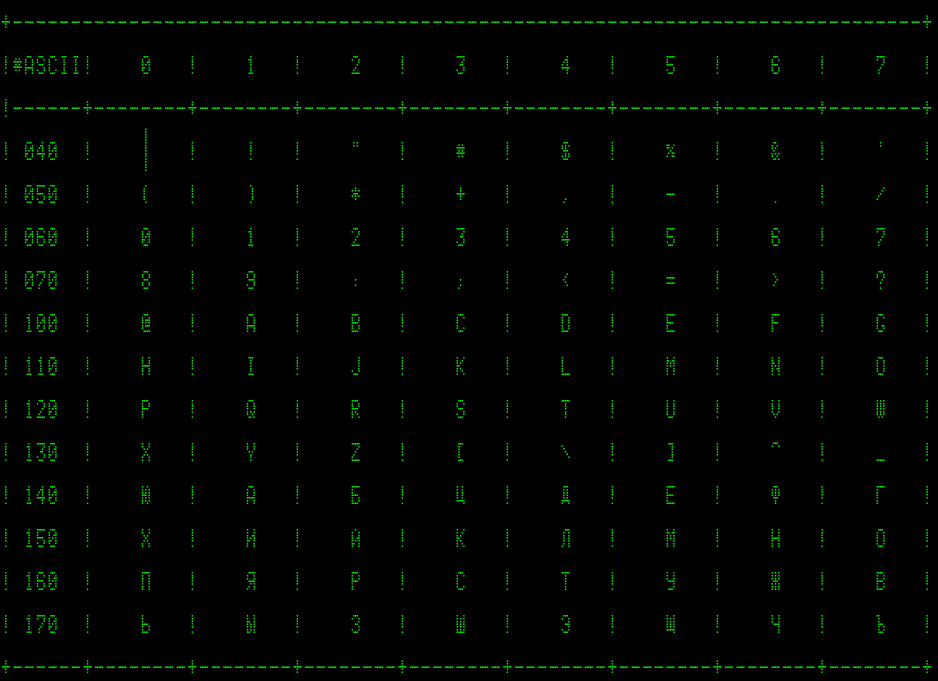

# Терминал Видеотон-340
Терминал "Видеотон-340" выпускался в Венгрии с начала 1970-х годов в городе Секешфехервар.


## Технические характеристики
* Диагональ экрана - 280 мм;
* полезная площадь - 200x140 мм (16 строк по 80 символов);
* емкость памяти - 16x80=1280 символов;
* формат символа - 5x7 растровых точек;
* ширина строки - 16 растровых точек: 7+4 подчеркивания+5 пробелов;
* длина позиции - 7 растровых точек: 5+2 пробела

## Шрифт для эмулятора
Шрифт разработан Леонидом Брухисом и расположен в репозитарии [https://github.com/besm6/besm6-archive/tree/master/fonts/](https://github.com/besm6/besm6-archive/tree/master/fonts)

Вариант рендера в браузере:


## Включение на web-страницу
```html
<style type="text/css">
 @font-face {font-family: 'VT340-0513';src: url('/fonts/VT-340-0513.ttf') format('truetype');}

.VT340 {
        font-family: VT340;
        font-weight: normal;
        font-style: normal;
}
</style>
<pre style="font-family: VT340-0513; font-size:20pt; ">
Hello, World!!!
</pre>
```
Использование терминала на примере БЭСМ-4 описано в публикации: [ВЫВОД ИНФОРМАЦИИ НА ДИСПЛЕЙ ВТ-340, ПОДКЛЮЧЕННЫЙ К ЭВМ БЭСМ-4](https://github.com/besm6/besm6-archive/blob/master/doc/%D0%92%D1%8B%D0%B2%D0%BE%D0%B4-%D0%BD%D0%B0-%D0%92%D0%A2-340-%D0%91%D0%AD%D0%A1%D0%9C4.pdf)
